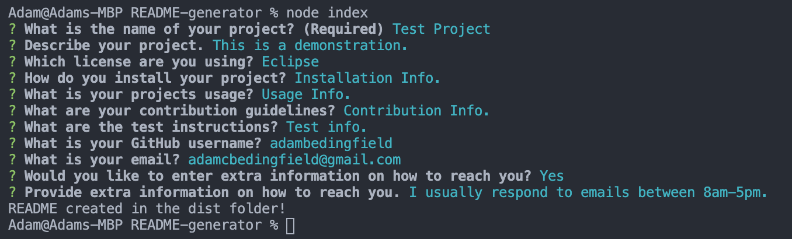
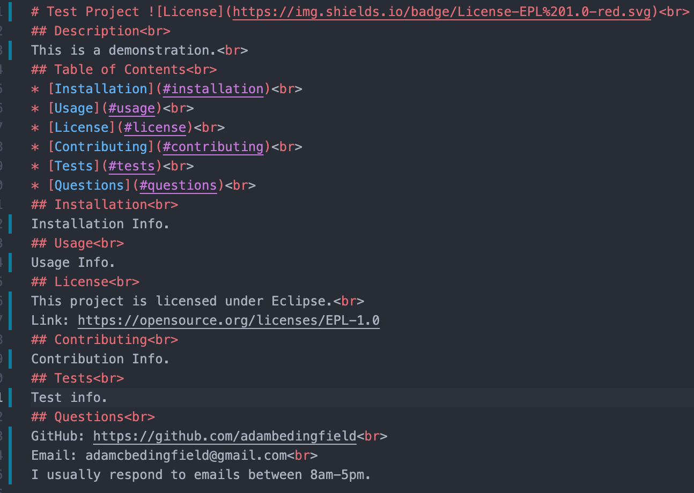

# README Generator
## Description
README Generator is an easy to use application that will ask you a series of questions and then build a README.md based on your responses.
## Prompt
To run the project simply type in "node index" in the terminal and you can then answer the series of questions shown below.

You can choose between four different licenses (Apache, Boost, BSD, and Eclipse) and information pertaining to them will be added into your README. You may also choose to not include extra contact info though it will default to yes if you don't choose.
## Generated README
Once you have answered all the questions your README.md will be created in the dist folder.
An example of a finished README.md is shown below.

This can then be copied/imported/etc. to wherever your README is needed. A table of contents is included by default that will jump within the README to the section clicked on.
## Technologies
This project was made with Javascript, Node.js, Inquirer NPM, GitHub, and VSCode
## Contact Me
adamcbedingfield@gmail.com